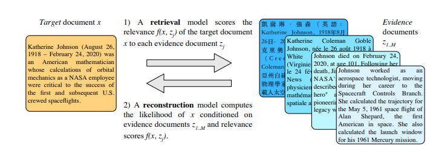

</img>

## Marge - Pre-training via Paraphrasing

Implementation of <a href="https://arxiv.org/abs/2006.15020">Marge</a>, Pre-training via Paraphrasing, in Pytorch. It is an alternative to masked language modeling pretraining, where an encoder / decoder attention network learns to reconstruct a target document from a collection of evidence documents.

## Install

```bash
$ pip install marge-pytorch
```

## Usage

```python
import torch
import numpy as np
from torch.utils.data import DataLoader

from marge_pytorch import Marge, TrainingWrapper

# your documents must be tokenized and stored as memmap in the shape (num documents, seq length)

# constants
NUM_DOCS = 10000
SEQ_LEN = 1024
SHAPE = (NUM_DOCS, SEQ_LEN)

# generate mock training data
f = np.memmap('./train.dat', dtype=np.int32, mode='w+', shape=SHAPE)
f[:] = np.random.randint(0, 20000, size=SHAPE)
del f

# generate mock masking data
f = np.memmap('./train.mask.dat', dtype=np.bool, mode='w+', shape=SHAPE)
f[:] = np.full(SHAPE, True)
del f

# instantiate model

model = Marge(
    dim = 512,
    num_tokens = 20000,
    max_seq_len = SEQ_LEN,
    enc_depth = 12,
    enc_retrieval_depth = 4,                # defaults to 4 as in paper (take the CLS token after the 4th layer of the encoder)
    enc_heads = 8,
    enc_ff_mult = 4,
    dec_depth = 12,
    dec_heads = 8,
    dec_ff_mult = 16                        # paper noted that decoder needs to have much bigger feed forward sizes
)

# wrap your model and your documents

trainer = TrainingWrapper(
    model,
    num_documents = NUM_DOCS,
    doc_seq_len = SEQ_LEN,
    num_evidence = 4,                         # number of evidence documents to fetch per target document to construct
    reindex_batch_size = 32,                  # batch size to use when reindexing
    documents_memmap_path = './train.dat',    # path to the mem-mapped documents
    masks_memmap_path = './train.mask.dat',   # if None is supplied, will assume all tokens are visible
    use_faiss_ann = True                      # set this to false if you have a low number of documents, and approximate nearest neighbor is not needed
)

# instantiate dataloader

dl = DataLoader(trainer.dataset, batch_size=16)

# now you can train, and use the reindex method on the training wrapper at appropriate intervals

for ind, data in enumerate(dl):
    loss = trainer(data)
    loss.backward()
    # optimizer step and all that

    # reindex and precompute knn every 10000 steps, as in paper
    if ind > 0 and ind % 10000 == 0:
        trainer.reindex()
```

Save your model after much training

```python
torch.save(model, f'./trained-model.pt')
```

## Sampling

You can sample from the decoder with the following instructions

```python
# some random evidence from the dataset
# or provide your own in the dimensions (b x num_evidences x seq_len)
*_, evidence, mask = trainer.dataset[0:1]

# assume 1 is start token
prime = torch.tensor([[1.]]).long().cuda()

# supply your own document similarities array (b x num_evidences)
# if not supplied, will default to 1. for all evidence
doc_similarities = torch.ones(evidence.shape[:2]).float().cuda()

# generate sample of length 1024
samples = model.generate(prime, 1024, evidence, mask = mask, similarities = doc_similarities)
```

## Citations

```bibtex
@misc{lewis2020pretraining,
    title={Pre-training via Paraphrasing},
    author={Mike Lewis and Marjan Ghazvininejad and Gargi Ghosh and Armen Aghajanyan and Sida Wang and Luke Zettlemoyer},
    year={2020},
    eprint={2006.15020},
    archivePrefix={arXiv},
    primaryClass={cs.CL}
}
```

```bibtex
@misc{komatsuzaki2020current,
    title={Current Limitations of Language Models: What You Need is Retrieval},
    author={Aran Komatsuzaki},
    year={2020},
    eprint={2009.06857},
    archivePrefix={arXiv},
    primaryClass={cs.CL}
}
```
